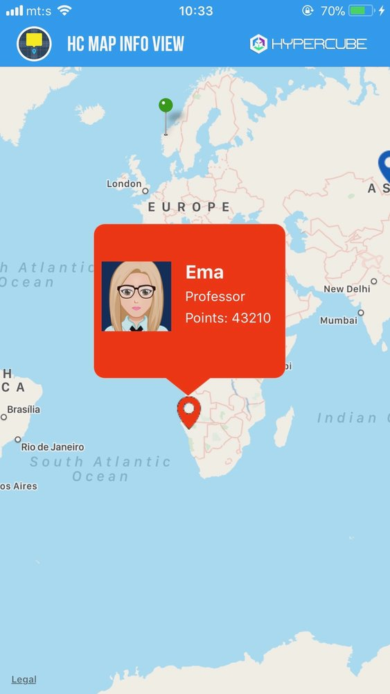

[](http://cocoapods.org/pods/HCMapInfoView)
[](http://cocoapods.org/pods/HCMapInfoView)
[](http://cocoapods.org/pods/HCMapInfoView)


**HCMapInfoView** is an iOS library which facilitates creating custom info views for Apple maps. It also makes easy to create pins (annotation views).



## Installing

### Podfile

[CocoaPods](https://cocoapods.org/) is a dependency manager for Objective-C and Swift, which automates and simplifies the process of using 3rd-party libraries like HCMapInfoView in your projects.<br><br>
To integrate **HCMapInfoView** into your Xcode project using CocoaPods, specify it in your Podfile:

```Ruby
target '<TargetName>' do
    use_frameworks!
    pod 'HCMapInfoView'
end
```

Then, run the following command:

```
$ pod install
```

### With source code

If you prefer not to use CocoaPods as a dependency manager, you can integrate HCMapInfoView into your project manually. Just download repository and include Source/HCMapInfoView folder into your project.

## Usage 

Using this library includes several basic steps:

1. **Add HCMapInfoView library to your project via CocoaPods or manually.**
<br>If you have installed this library using Podfile, include HCMapInfoView library in your project using directive:

    ```swift
    import HCMapInfoView
    ```   
2. **Add MKMapKit on desired place.**
<br>Place a MKMapKit into your .storyboard or .xib file, Also, create the outlet for this MKMapKit instance in the appropriate file.

    ```swift
    @IBOutlet weak var mapView: MKMapView!
    ``` 
    You can also add MKMapKit instance programatically.
3. **Prepare custom info views**
<br>Performing this step means creating custom info views which should be shown when the user selects a pin on the map. In that sense, you have to:
    * Subclass HCAnnotation and to create those subclass for showing custom info views. In fact, you can use HCAnnotation in original form, but in that case, you can only use annotation view title and subtitle as properties.
    * Subclass HCMapInfoView in order to create your own class for custom info views and create custom UIView in nib (xib) file which will be shown when the user selects a pin. Define your HCMapInfoView subclass as a class for this custom UIView created in nib (xib) file. One of the main reasons for using this class is the fact that this custom view will recognize transparent areas as empty space, so tapping on the transparent area on that view will have the same effect as tapping outside info view, so it will result in closing that info view.

4. **Add annotations on map.** 
<br>If you want to add a simple pin on the map which shows simple callout, you can do it without problems. But, if you want to show simple or custom annotation pins which shows custom info views, you need to use HCAnnotation instead of basic MKPointAnnotation. Also, you can subclass HCAnnotation to extend its features. Here is the example how to create simple HCAnnotation and add it to your map:
   
    ```swift
    mapView.addAnnotation(MKPointAnnotation(title: "School", subtitle: "Business school", coordinate: CLLocationCoordinate2D(latitude: 20.0, longitude: 100.0)))
    ``` 
5. **Implement MKMapViewDelegate methods and create view for every annotation (MKAnnotationView)**
<br>In order to show pins on the map and show custom info views for those pins, you need to implement basic MKMapViewDelegate methods. For creating pins which can show custom info views, you only have to implement MKMapViewDelegate method for creating annotation views. 
<br><br>If you want to make simple pin which shows simple callout, you can use HCPinAnnotationView class and its hcCreateDefaultPin static method as a shortcut for creating, like in this sample code:  
   ```swift
    func mapView(_ mapView: MKMapView, viewFor annotation: MKAnnotation) -> MKAnnotationView? 
    {
        ///...
        return HCPinAnnotationView.hcCreateDefaultPin(forMap: mapView, forAnnotation: annotation, withReuseIdentifier: "BasicMapPin")
        ///...
    }
    ``` 
       
    If you need to make simple pin which can show custom info views, you can use the same method, but with additional parameters which define the class for custom map info view and nib name, like in this sample code: 
       
    ```swift
    func mapView(_ mapView: MKMapView, viewFor annotation: MKAnnotation) -> MKAnnotationView? 
    {
        //...
        return HCPinAnnotationView.hcCreateDefaultPin(forMap: mapView, forAnnotation: annotation, withPinColor: UIColor.hcColorWithHex("389E13"), withReuseIdentifier: "GreenMapPin", withClass: MapInfoGreenView.self, mapInfoViewName: "MapInfoGreenView", showInfoViewHandler: {infoView in
            if let greenView = infoView as? MapInfoGreenView
            {
                greenView.update(withAnnotation: singleAnnotation)
            }
        })
        //...
    }
    ``` 
       
       
    Further, if you want to show pin with a custom image which can show callout, but not custom info view, you can use HCAnnotationView class and its static hcCreatePin method, like in this sample code: 
       
    ```swift
    func mapView(_ mapView: MKMapView, viewFor annotation: MKAnnotation) -> MKAnnotationView? 
    {
        //...
        return HCAnnotationView.hcCreatePin(forMap: mapView, forAnnotation: annotation, withPinImage:#imageLiteral(resourceName: "blueMapPin"), withReuseIdentifier:"AnimalMapPin")
        //...
    }
    ``` 
       
    And finally, if you want to show pin with a custom image which can show custom info views, you can the same method, but with additional parameters which define the class for custom map info view and nib name, like in this sample code:
       
    ```swift
    func mapView(_ mapView: MKMapView, viewFor annotation: MKAnnotation) -> MKAnnotationView? 
    {
        //...
        return HCAnnotationView.hcCreatePin(forMap: mapView, forAnnotation: annotation, withPinImage:#imageLiteral(resourceName: "blueMapPin"), withReuseIdentifier:"AnimalMapPin", withClass: MapInfoAnimalView.self, mapInfoViewName: "MapInfoAnimalView", showInfoViewHandler: {infoView in
                if let blueView = infoView as? MapInfoAnimalView
                {
                    blueView.update(withAnimal: animal)
                }
                        
            })
        //...
    }
    ``` 

In any case, you can download and run HCMapInfoView Sample project from this repository. In this project, there is an example of usage where you can find out how to use this library. Also, every property and method in this library is well documented, so you'll understand meaning and purpose of every class, extension, property, method or method parameter.


## Short preview of HCMapInfoView basic methods

For the better understanding how to use this library, here is the short overview of basic HCMapInfoView methods. Among other things, the most important methods in this library are:
* Method for creating default pin
* Method for creating pin with custom image

### Method for creating default pin

```swift
/// Create default map pin, i.e. MKPinAnnotationView instance
///
/// - Parameters:
///   - map: Reference to MKMapView instance where the pin has to be placed.
///   - annotation: Annotation for which we need to create pin.
///   - pinColor: Pin color. The default value is red color (default system color).
///   - reuseIdentifier: Reuse identifier for annotation view.
///   - showCallout: Defines if callout or custom info view should be shown when annotation view is selected.
///   - mapInfoViewClass: Class which defines HCMapInfoView subclass for custom map info view.
///   - mapInfoViewNibName: Nib name for custom map info view.
///   - infoViewSize: Desired size for info view. If not defined, the view will use its size from the nib file.
///   - showInfoViewHandler: Handler for showing info view. The intention is to use this handler to update the generated view with desired data.
/// - Returns: Default pin, i.e. HCPinAnnotationView instance.
static func hcCreateDefaultPin<T:HCMapInfoView>(forMap map:MKMapView, forAnnotation annotation:MKAnnotation, withPinColor pinColor:UIColor? = nil, withReuseIdentifier reuseIdentifier:String, showCallout:Bool = true, withClass mapInfoViewClass:T.Type? = nil, mapInfoViewName mapInfoViewNibName:String? = nil, infoViewSize:CGSize? = nil, showInfoViewHandler:ShowInfoViewCompletionHandler? = nil) -> HCPinAnnotationView?
```

### Method for creating pin with custom image

```swift
/// Create custom map pin (annotation view)
///
/// - Parameters:
///   - map: Reference to MKMapView instance where the pin has to be placed.
///   - annotation: Annotation for which we need to create pin.
///   - pinImage: Pin image. If this parameter is not provided, default system pin will be used.
///   - pinCenterOffset: Position offset for custom pin (annotation view).
///   - reuseIdentifier: Reuse identifier for annotation view.
///   - showCallout: Defines if callout or custom info view should be shown when annotation view is selected.
///   - mapInfoViewClass: Class which defines HCMapInfoView subclass for custom map info view
///   - mapInfoViewNibName: Nib name for custom map info view.
///   - infoViewSize: Desired size for info view. If not defined, the view will use its size from the nib file.
///   - showInfoViewHandler: Handler for showing info view. The intention is to use this handler to update the generated view with desired data.
/// - Returns: Custom pin, i.e. custom map annotation (HCAnnotationView instance).
static func hcCreatePin<T:HCMapInfoView>(forMap map:MKMapView, forAnnotation annotation:MKAnnotation, withPinImage pinImage:UIImage? = nil, pinCenterOffset:CGPoint? = nil, withReuseIdentifier reuseIdentifier:String, showCallout:Bool = true, withClass mapInfoViewClass:T.Type? = nil, mapInfoViewName mapInfoViewNibName:String? = nil, infoViewSize:CGSize? = nil, showInfoViewHandler:ShowInfoViewCompletionHandler? = nil) -> HCAnnotationView?
```

## Notes

If you don't follow implementation steps, i.e., if you try to make own implementation based on this library, more or less features maybe won't work, because custom classes in this library are interdependent.

If you find any bug, please report it, and we will try to fix it ASAP. Also, any suggestion is welcome.

## Credits

**HCMapInfoView** is owned and maintained by the [Hypercube](http://hypercubesoft.com/).
